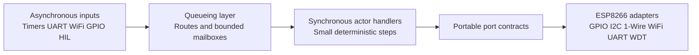
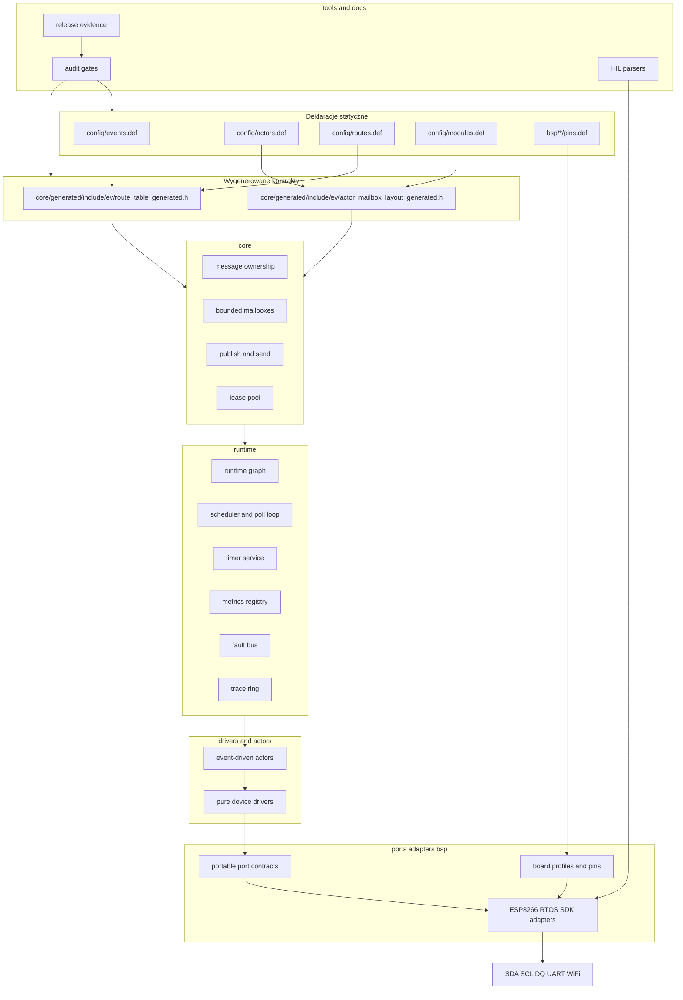
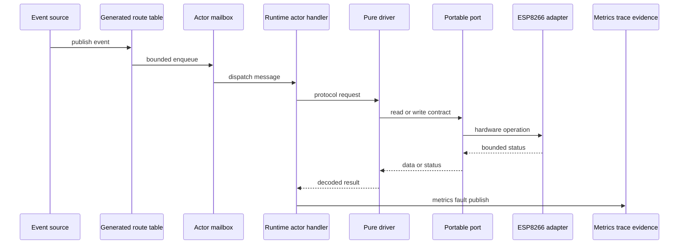
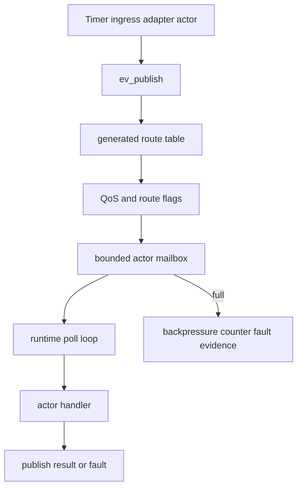
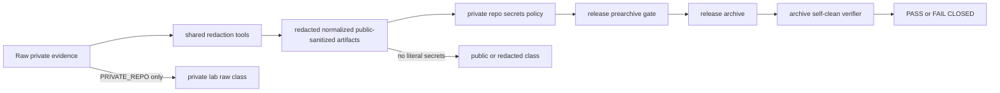
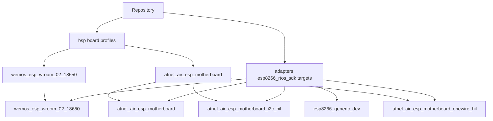
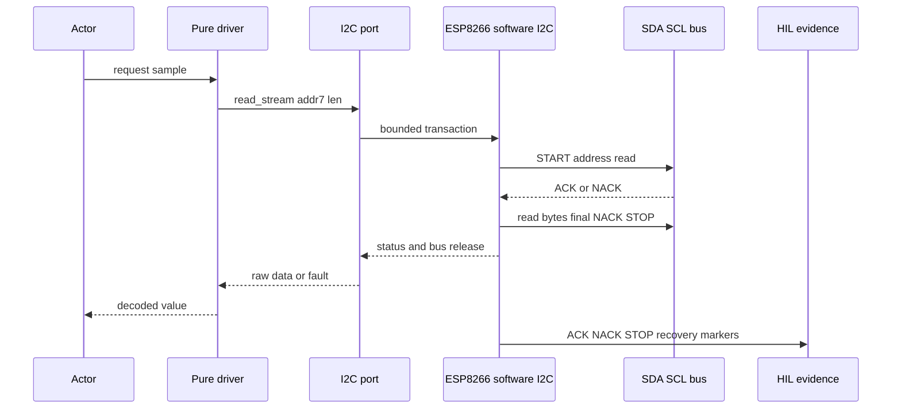
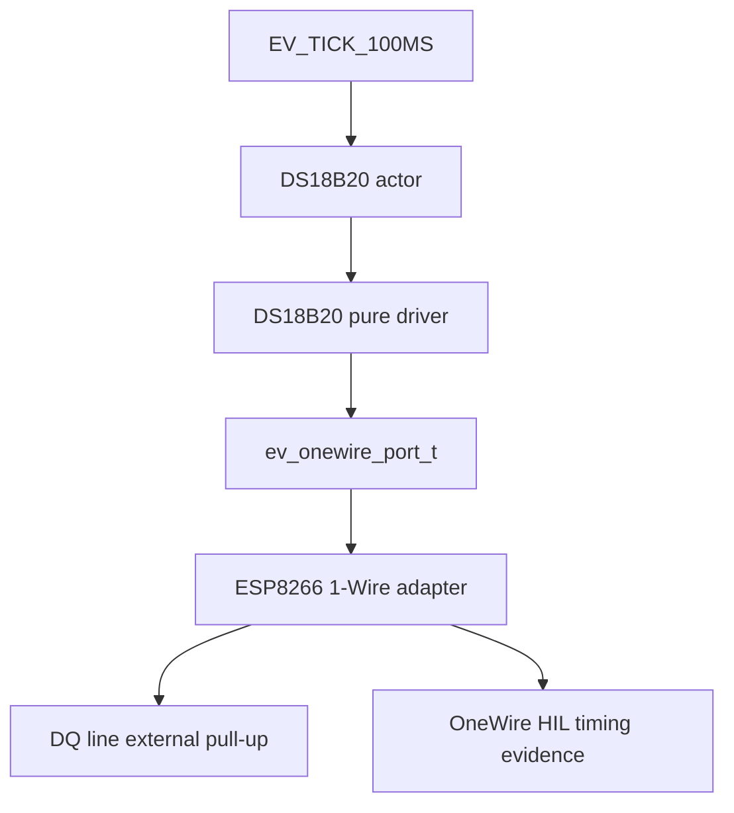
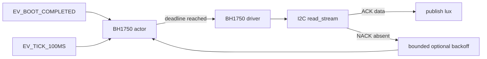
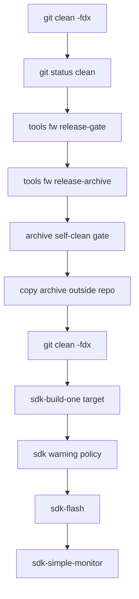

# ESP8266 Event-Driven Framework

`esp8266-event-driven-framework` to statyczno-pamięciowy, event-driven i evidence-driven framework w języku C dla systemów opartych o ESP8266 RTOS SDK. Projekt jest przeznaczony do małych urządzeń IoT, ale został zbudowany z rygorem typowym dla systemów embedded: przewidywalny czas wykonania, brak alokacji w hot-path, jasne granice warstw, testy hostowe, sanitizer readiness, HIL, release gates oraz kontrolowane evidence.

To **nie jest klasyczny przykład Arduino/ESP8266** typu `setup()` / `loop()` i nie jest aplikacją, w której logika urządzeń znajduje się bezpośrednio w `main.c`. Projekt jest frameworkiem warstwowym: deklaratywne definicje zdarzeń i tras generują statyczne kontrakty, runtime dostarcza bounded mailboxy i dispatch, drivery są czystą logiką protokołu urządzeń, aktorzy realizują event-driven scheduling/retry/publish, a adaptery ESP8266 izolują FreeRTOS, GPIO, WiFi, UART, I2C i 1-Wire.

## Pięć filarów jakości

| Filar | Znaczenie w projekcie |
|---|---|
| **Filar 1: Hot-Path bez alokacji / Pure Core & Zero-Copy** | Krytyczne ścieżki runtime używają statycznej pamięci, bounded mailboxów, jawnego ownership wiadomości i nie alokują heap w czasie pracy. |
| **Filar 2: Clean Architecture / izolacja warstw** | `core`, `runtime`, `ports`, `drivers`, `actors`, `bsp`, `adapters`, `apps` i `tools` mają odseparowane odpowiedzialności. |
| **Filar 3: Evidence-Based Engineering, tryb łagodzony RE** | Każde twierdzenie jakościowe wymaga dowodu: host tests, sanitizer, strict build, route/static contracts, SDK logs, HIL parsers, release evidence i self-clean archive. |
| **Filar 4: Zero Undefined Behavior / sanitizer readiness** | Projekt wspiera C17 + `-Werror` oraz deterministyczne shardy ASAN/UBSAN. |
| **Filar 5: Event-Driven / asynchroniczny przepływ zdarzeń** | Aktorzy komunikują się przez generowane trasy i bounded mailboxy. Operacje sensorów są sterowane zdarzeniami, deadline'ami i backoffem. |

---

## Spis treści

- [Najkrótsza ścieżka](#najkrótsza-ścieżka)
- [Dlaczego architektura jest nietypowa dla IoT](#dlaczego-architektura-jest-nietypowa-dla-iot)
- [Architektura warstwowa](#architektura-warstwowa)
- [Przepływ zdarzeń runtime](#przepływ-zdarzeń-runtime)
- [Evidence lifecycle](#evidence-lifecycle)
- [Struktura repozytorium](#struktura-repozytorium)
- [Obsługiwane boardy i targety](#obsługiwane-boardy-i-targety)
- [Walidacja hostowa](#walidacja-hostowa)
- [Release archive](#release-archive)
- [Kompilacja SDK](#kompilacja-sdk)
- [Flashowanie i monitor szeregowy](#flashowanie-i-monitor-szeregowy)
- [Prywatne sekrety WiFi](#prywatne-sekrety-wifi)
- [I2C](#i2c)
- [1-Wire i DS18B20](#1-wire-i-ds18b20)
- [BH1750](#bh1750)
- [HIL i realne dowody sprzętowe](#hil-i-realne-dowody-sprzętowe)
- [Typowe problemy i szybkie naprawy](#typowe-problemy-i-szybkie-naprawy)
- [Kolejność operatorska](#kolejność-operatorska)
- [Następne kroki jakościowe](#następne-kroki-jakościowe)

---

## Najkrótsza ścieżka

### 1. Walidacja hostowa

```bash
git clean -fdx
git status --short

export EV_REPO_MODE=PRIVATE_REPO

make evidence-redaction-check
make private-repo-secrets-policy
make host-test
make property-test
make host-strict-test
make host-sanitize-test
```

### 2. Release archive

```bash
git clean -fdx
git status --short

export EV_REPO_MODE=PRIVATE_REPO

./tools/fw release-gate
./tools/fw release-archive

ARCHIVE="$(ls -t esp8266-event-driven-framework_*.tar.gz | head -n 1)"
echo "$ARCHIVE"
EV_RELEASE_ARCHIVE_PATH="$ARCHIVE" make release-archive-self-clean-gate
sha256sum "$ARCHIVE" > "$ARCHIVE.sha256"
```

Artefakty release trzymaj poza repo:

```bash
mkdir -p ~/esp8266-release-artifacts
cp "$ARCHIVE" "$ARCHIVE.sha256" ~/esp8266-release-artifacts/
```

Nie używaj ręcznego `git archive` jako normalnego workflow. Poprawna ścieżka to `./tools/fw release-archive`, ponieważ uruchamia release gates i self-clean archive verification.

### 3. Build Wemos ESP-WROOM-02 18650

```bash
mkdir -p build

export WEMOS_PROJECT=adapters/esp8266_rtos_sdk/targets/wemos_esp_wroom_02_18650
export FW_SDK_PROJECT_DIR="$WEMOS_PROJECT"
export EV_WEMOS_FLASH_VARIANT=4mb
export FW_MONITOR_BAUD=115200

./tools/fw wifi-secrets-status
./tools/fw sdk-distclean

./tools/fw sdk-build-one wemos_esp_wroom_02_18650 2>&1 | tee build/sdk-current.log

python3 tools/audit/sdk_warning_policy.py \
  --project-only \
  --latest-build-session \
  --session-kind build \
  --strict-build-session \
  --target wemos_esp_wroom_02_18650 \
  build/sdk-current.log
```

### 4. Flash Wemos

```bash
export FW_SDK_PROJECT_DIR=adapters/esp8266_rtos_sdk/targets/wemos_esp_wroom_02_18650
export FW_ESPPORT=/dev/ttyUSB0
export FW_MONITOR_BAUD=115200

./tools/fw sdk-flash
./tools/fw sdk-simple-monitor
```

W poprawnym logu flashowania powinno być widać target:

```text
/work/adapters/esp8266_rtos_sdk/targets/wemos_esp_wroom_02_18650
App "ev_wroom_02"
```

Jeżeli widzisz `esp8266_generic_dev`, przerwij i ponownie ustaw `FW_SDK_PROJECT_DIR`.

---

## Dlaczego architektura jest nietypowa dla IoT

Typowy projekt IoT często wygląda tak:

```text
main.c -> init WiFi -> init sensor -> while loop -> read -> publish -> delay
```

To jest szybkie dla demonstracji, ale źle skaluje się przy realnych płytkach, wspólnych magistralach I2C, timeoutach, błędach NACK, timingach 1-Wire, prywatnych sekretach, HIL, release evidence i długotrwałej pracy.

Ten projekt używa modelu podobnego do **Half-Sync/Half-Async**: niskopoziomowe operacje sprzętowe są izolowane w adapterach i bounded portach, a logika aplikacyjna działa jako event-driven aktorzy połączoni przez kolejkę/mailbox i generowane trasy.



W praktyce oznacza to:

- aktor nie dotyka bezpośrednio SDK ESP8266,
- driver nie publikuje eventów i nie zna runtime,
- adapter nie zna logiki domenowej sensora,
- port jest czystym kontraktem C,
- release nie jest deklaracją, tylko wynikiem gate'ów i evidence.

---

## Architektura warstwowa



### Reguła zależności

```text
core      -> brak SDK, brak BSP, brak FreeRTOS, brak logiki konkretnego aktora
runtime   -> core + usługi runtime, bez ESP8266 SDK internals
drivers   -> czysty protokół urządzenia, bez runtime i bez actor context
actors    -> state machine, retry/backoff, publish, bez bezpośredniego SDK I2C/1-Wire
ports     -> przenośne kontrakty, bez zależności od ESP8266
adapters  -> ESP8266 RTOS SDK, FreeRTOS, GPIO, UART, WiFi, WDT, BSP wiring
bsp       -> profile boardów, piny, board-local secrets
tools     -> routegen, audit, HIL, release, SDK matrix, serial monitor
```

Publiczne `core/`, `runtime/`, `ports/`, `drivers/` i `actors/` nie mogą zależeć od `esp_err_t`, `TickType_t`, `driver/i2c.h`, SDK I2C command-link API, BSP pin headers ani adapter internals.

---

## Przepływ zdarzeń runtime

Ten diagram używa bezpiecznych nazw uczestników Mermaid. Nie używaj aliasu `Actor` w `sequenceDiagram`, ponieważ GitHub/Mermaid może potraktować go jako token specjalny i zgłosić błąd parsera.



Aktor nie powinien znać szczegółów ESP8266 SDK. Adapter nie powinien znać logiki domenowej sensora. Driver nie powinien publikować eventów. Każda warstwa ma jedno zadanie.

### Dispatch, mailbox i backpressure



---

## Evidence lifecycle



Zasada podstawowa:

```text
PARSER_SELF_TEST_PASS != REAL_HIL_PASS
```

Brak fizycznego boardu, serial logu, logic-analyzer capture, runtime soak transcriptu albo SDK memory/stack artefaktu to `ENVIRONMENT_BLOCKED`, nie PASS.

---

## Struktura repozytorium

```text
core/       Prymitywy frameworka: wiadomości, ownership, mailboxy,
            route table, lease pool, publish/send, actor runtime primitives.

runtime/    Runtime graph, scheduler, actor instances, timers, ingress,
            delivery, quiescence, metrics, fault bus, trace ring,
            command security, network outbox.

ports/      Przenośne kontrakty: I2C, 1-Wire, clock, log, network, WDT.
            Nagłówki portów muszą być neutralne względem ESP8266 SDK.

drivers/    Czyste protokoły urządzeń, np. DS18B20 i BH1750.
            Bez runtime, bez actor context, bez typów SDK.

actors/     Event-driven state machines: boot, tick, retry, backoff,
            publish, fault reporting i obsługa urządzeń opcjonalnych.

adapters/   ESP8266 RTOS SDK integration: GPIO, software I2C, 1-Wire,
            WiFi, UART, WDT, runtime app i targety SDK/HIL.

bsp/        Profile boardów, piny, wiring truth i private board-local secrets.

apps/       Composition roots i demo application wiring.

config/     Deklaratywne katalogi: events, actors, routes, modules,
            pins, capabilities, memory budgets i evidence definitions.

tools/      Routegen, audit gates, release tools, SDK matrix, HIL parsers,
            serial monitor i WiFi secret helpers.

docs/       Architektura, HIL contracts, release evidence, specs, reports.

tests/      Host tests, property tests i fakes.
```

---

## Obsługiwane boardy i targety

### Mapa targetów SDK

| Board / cel | Target SDK | Typ użycia | Uwagi |
|---|---|---|---|
| Wemos ESP-WROOM-02 18650 | `wemos_esp_wroom_02_18650` | główny smoke/build/flash | wymaga `bsp/wemos_esp_wroom_02_18650/board_secrets.local.h` dla WiFi |
| Generic ESP8266 dev | `esp8266_generic_dev` | neutralny target SDK | dobry do sanity build, nie mylić z Wemos flash |
| Wemos D1 mini | `wemos_d1_mini` | wariant płytki ESP8266 | używać po sprawdzeniu BSP i pinów |
| Adafruit Feather HUZZAH | `adafruit_feather_huzzah_esp8266` | wariant płytki ESP8266 | używać po sprawdzeniu BSP i pinów |
| ATNEL AIR ESP MOTHERBOARD | `atnel_air_esp_motherboard` | target płytki ATNEL | board profile i wiring truth |
| ATNEL I2C HIL | `atnel_air_esp_motherboard_i2c_hil` | HIL I2C | wymaga fizycznego fixture i serial logu |
| ATNEL OneWire HIL | `atnel_air_esp_motherboard_onewire_hil` | HIL DS18B20 | wymaga WiFi ON timing evidence dla real PASS |
| ATNEL WiFi HIL | `atnel_air_esp_motherboard_wifi_hil` | HIL WiFi | wymaga boardu i kontrolowanego środowiska |

### Diagram boardów i targetów



### ATNEL wiring truth

Dla ATNEL AIR ESP i ATNEL WIFI ESP MOTHERBOARD piny wynikają ze schematu i BSP, nie z przykładu internetowego. Dla motherboard krytyczna mapa to:

```text
SCL -> GP04
SDA -> GP05
DQ  -> GP12
```

Dla ATNEL AIR ESP linie `SCL`, `SDA` i `1-WIRE` są wyprowadzone przez złącza i rezystory pull-up zgodnie z dokumentacją HIL. Potwierdzenie elektryczne powinno być częścią realnego HIL, nie tylko deklaracją w kodzie.

---

## Walidacja hostowa

Podstawowa walidacja:

```bash
make clean
make routegen-check
make static-contracts
make host-test
make property-test
```

Strict build:

```bash
make host-strict-test
```

`host-strict-test` używa C17 i `-Werror`.

Sanitizery:

```bash
make host-sanitize-test
```

Na niektórych konfiguracjach Linux ASAN wymaga niższego `vm.mmap_rnd_bits`. Jeśli pojawia się spam `AddressSanitizer:DEADLYSIGNAL` bez stack trace, sprawdź:

```bash
sudo cat /proc/sys/vm/mmap_rnd_bits
```

Jeżeli wynik to `32`, ustaw:

```bash
sudo sysctl -w vm.mmap_rnd_bits=28
```

Aby utrwalić na maszynie developerskiej:

```bash
echo 'vm.mmap_rnd_bits=28' | sudo tee /etc/sysctl.d/99-asan-mmap-rnd.conf
sudo sysctl --system
sudo cat /proc/sys/vm/mmap_rnd_bits
```

---

## Release archive

Release należy robić na czystym repo **przed** SDK buildem.

```bash
git clean -fdx
git status --short

export EV_REPO_MODE=PRIVATE_REPO

./tools/fw release-gate
./tools/fw release-archive

ARCHIVE="$(ls -t esp8266-event-driven-framework_*.tar.gz | head -n 1)"
echo "$ARCHIVE"
EV_RELEASE_ARCHIVE_PATH="$ARCHIVE" make release-archive-self-clean-gate
sha256sum "$ARCHIVE" > "$ARCHIVE.sha256"
```

Następnie przenieś artefakty poza repo:

```bash
mkdir -p ~/esp8266-release-artifacts
cp "$ARCHIVE" "$ARCHIVE.sha256" ~/esp8266-release-artifacts/
```

### Dlaczego nie `git archive`?

Ręczne `git archive` tworzy technicznie poprawny tarball, ale omija dyscyplinę projektu: release gates, self-clean archive verification i secret/evidence checks. Normalny workflow to `./tools/fw release-archive`.

---

## Kompilacja SDK

### Zasada ogólna

Do release/evidence używaj `sdk-build-one`, ponieważ generuje jednoznaczne markery:

```text
EV_SDK_BUILD_TARGET=<target>
EV_SDK_BUILD_BEGIN
EV_SDK_BUILD_STATUS=PASS
EV_SDK_BUILD_END
```

Nie traktuj plain `./tools/fw sdk-build` jako głównego dowodu release/evidence.

### Wemos ESP-WROOM-02 18650

```bash
mkdir -p build

export WEMOS_PROJECT=adapters/esp8266_rtos_sdk/targets/wemos_esp_wroom_02_18650
export FW_SDK_PROJECT_DIR="$WEMOS_PROJECT"
export EV_WEMOS_FLASH_VARIANT=4mb
export FW_MONITOR_BAUD=115200

./tools/fw wifi-secrets-status
./tools/fw sdk-distclean

./tools/fw sdk-build-one wemos_esp_wroom_02_18650 2>&1 | tee build/sdk-current.log

grep -E 'EV_SDK_BUILD_(BEGIN|TARGET|STATUS|END)' build/sdk-current.log
grep 'EV_SDK_BUILD_TARGET=wemos_esp_wroom_02_18650' build/sdk-current.log

python3 tools/audit/sdk_warning_policy.py \
  --project-only \
  --latest-build-session \
  --session-kind build \
  --strict-build-session \
  --target wemos_esp_wroom_02_18650 \
  build/sdk-current.log
```

### Generic ESP8266 dev

```bash
mkdir -p build

export FW_SDK_PROJECT_DIR=adapters/esp8266_rtos_sdk/targets/esp8266_generic_dev
export EV_WEMOS_FLASH_VARIANT=4mb
export FW_MONITOR_BAUD=115200

./tools/fw sdk-distclean
./tools/fw sdk-build-one esp8266_generic_dev 2>&1 | tee build/sdk-generic.log
```

### ATNEL AIR ESP MOTHERBOARD

```bash
mkdir -p build

export FW_SDK_PROJECT_DIR=adapters/esp8266_rtos_sdk/targets/atnel_air_esp_motherboard
export FW_MONITOR_BAUD=115200

./tools/fw sdk-distclean
./tools/fw sdk-build-one atnel_air_esp_motherboard 2>&1 | tee build/sdk-atnel.log
```

### ATNEL I2C HIL target

```bash
export FW_SDK_PROJECT_DIR=adapters/esp8266_rtos_sdk/targets/atnel_air_esp_motherboard_i2c_hil
./tools/fw sdk-distclean
./tools/fw sdk-build-one atnel_air_esp_motherboard_i2c_hil 2>&1 | tee build/sdk-atnel-i2c-hil.log
```

### ATNEL OneWire HIL target

```bash
export FW_SDK_PROJECT_DIR=adapters/esp8266_rtos_sdk/targets/atnel_air_esp_motherboard_onewire_hil
./tools/fw sdk-distclean
./tools/fw sdk-build-one atnel_air_esp_motherboard_onewire_hil 2>&1 | tee build/sdk-atnel-onewire-hil.log
```

---

## Flashowanie i monitor szeregowy

### Wemos ESP-WROOM-02 18650

```bash
export FW_SDK_PROJECT_DIR=adapters/esp8266_rtos_sdk/targets/wemos_esp_wroom_02_18650
export FW_ESPPORT=/dev/ttyUSB0
export FW_MONITOR_BAUD=115200

./tools/fw sdk-flash
./tools/fw sdk-simple-monitor
```

Poprawny log musi zawierać target Wemos:

```text
/work/adapters/esp8266_rtos_sdk/targets/wemos_esp_wroom_02_18650
App "ev_wroom_02"
```

### Generic ESP8266 dev

```bash
export FW_SDK_PROJECT_DIR=adapters/esp8266_rtos_sdk/targets/esp8266_generic_dev
export FW_ESPPORT=/dev/ttyUSB0
export FW_MONITOR_BAUD=115200

./tools/fw sdk-flash
./tools/fw sdk-simple-monitor
```

### ATNEL AIR ESP MOTHERBOARD

```bash
export FW_SDK_PROJECT_DIR=adapters/esp8266_rtos_sdk/targets/atnel_air_esp_motherboard
export FW_ESPPORT=/dev/ttyUSB0
export FW_MONITOR_BAUD=115200

./tools/fw sdk-flash
./tools/fw sdk-simple-monitor
```

### ATNEL I2C HIL

```bash
export FW_SDK_PROJECT_DIR=adapters/esp8266_rtos_sdk/targets/atnel_air_esp_motherboard_i2c_hil
export FW_ESPPORT=/dev/ttyUSB0
export FW_MONITOR_BAUD=115200

./tools/fw sdk-flash
./tools/fw sdk-simple-monitor | tee build/atnel-i2c-hil.log
EV_HIL_ATNEL_I2C_SERIAL_LOG=build/atnel-i2c-hil.log make hil-atnel-i2c-gate
```

### ATNEL OneWire HIL

```bash
export FW_SDK_PROJECT_DIR=adapters/esp8266_rtos_sdk/targets/atnel_air_esp_motherboard_onewire_hil
export FW_ESPPORT=/dev/ttyUSB0
export FW_MONITOR_BAUD=115200

./tools/fw sdk-flash
./tools/fw sdk-simple-monitor | tee build/atnel-onewire-hil.log
EV_HIL_ATNEL_ONEWIRE_SERIAL_LOG=build/atnel-onewire-hil.log make hil-atnel-onewire-gate
```

---

## Prywatne sekrety WiFi

Właściciel repo może świadomie trzymać realne sekrety w allowlistowanych private-lab plikach BSP, np.:

```text
bsp/wemos_esp_wroom_02_18650/board_secrets.local.h
```

To nie oznacza, że sekrety mogą trafiać do logów, raportów lub release artifacts.

Dozwolone w `PRIVATE_REPO`:

```text
PRIVATE_LAB_SECRET_SOURCE
PRIVATE_LAB_RAW_EVIDENCE
```

Zabronione zawsze:

```text
redacted
normalized
report
summary
manifest
json
md
patch
diff
CI output
public artifacts
```

Kontrola:

```bash
export EV_REPO_MODE=PRIVATE_REPO
make evidence-redaction-check
make private-repo-secrets-policy
```

Naprawa historycznego evidence:

```bash
make repair-evidence-redaction
make evidence-redaction-check
make private-repo-secrets-policy
```

Po naprawie commituj tylko świadomie zmienione sanitized evidence. Nie pokazuj zwykłego `git diff`, jeśli diff mógłby zawierać historyczny sekret w liniach usuwanych.

---

## I2C

Projekt nie używa SDK command-link I2C w hot-path. Runtime używa bounded software I2C master w adapterze ESP8266, z publicznym portem `ev_i2c_port_t`.

Ważne reguły:

- publiczne adresy I2C są 7-bitowe,
- `read_stream` jest surowym bounded read: START, ADDR+READ, bajty, final NACK, STOP,
- NACK po adresie wymaga STOP/release,
- recovery nie jest wykonywane po każdym zwykłym scan-NACK,
- recovery jest dla stuck-low, timeout, failed STOP/release lub wymaganych device failures,
- 100 kHz jest defaultem,
- 400 kHz wymaga realnego logic-analyzer evidence.



---

## 1-Wire i DS18B20

DS18B20 ma czysty driver oraz actor odpowiedzialny za event-driven scheduling. Konwersja temperatury jest deadline-based; aktor nie powinien czytać scratchpada przed końcem konwersji.



Reguły:

- scratchpad CRC jest obowiązkowe,
- actor nie publikuje nowej temperatury przy CRC failure,
- `EV_TICK_100MS` jest kanonicznym źródłem czasu konwersji,
- realny PASS timingowy wymaga HIL z WiFi ON.

---

## BH1750

BH1750 jest wzorcowym małym sensorem po wprowadzeniu `read_stream`.

```text
drivers/src/ev_bh1750_driver.c       pure driver, lux conversion
actors/device/ev_bh1750_actor.c      boot, tick, optional-device retry/backoff, publish
ports/include/ev/port_i2c.h          read_stream contract
```

Brak BH1750 na magistrali jest obsługiwany jako optional-device condition. Actor nie retry'uje I2C co 100 ms po NACK; używa bounded backoff.



---

## HIL i realne dowody sprzętowe

Repo zawiera parsery i kontrakty dla:

- ATNEL I2C HIL,
- ATNEL OneWire/DS18B20 HIL,
- Wemos smoke evidence,
- runtime eventflow metrics,
- SDK build evidence,
- release archive evidence,
- logic-analyzer readiness.

Realne HIL powinno obejmować:

```text
I2C:
  START, address ACK, address NACK plus STOP,
  repeated START, read, final NACK, STOP release,
  bus idle after fault, SDA stuck-low recovery, SCL timeout.

OneWire:
  WiFi ON, reset low and high timing,
  presence pulse, read and write slots,
  scratchpad CRC, DQ release.

Runtime:
  30+ minut soak, dropped_events=0,
  backpressure_events=0, timer_deadline_misses=0,
  heap_allocations_hot_path=0, WDT reset=0.
```

---

## Typowe problemy i szybkie naprawy

### `patch-hygiene-gate` zgłasza SDK generated files

Przyczyna: release-prearchive został uruchomiony po SDK buildzie.

Naprawa:

```bash
git clean -fdx
make -j1 release-prearchive-gate
```

### `AddressSanitizer:DEADLYSIGNAL`

Sprawdź:

```bash
sudo cat /proc/sys/vm/mmap_rnd_bits
```

Jeżeli wynik to `32`:

```bash
sudo sysctl -w vm.mmap_rnd_bits=28
make clean
make -j1 host-sanitize-test
```

### Flashuje `esp8266_generic_dev`

Przyczyna: nie ustawiono `FW_SDK_PROJECT_DIR` w aktualnym terminalu.

Naprawa:

```bash
export FW_SDK_PROJECT_DIR=adapters/esp8266_rtos_sdk/targets/wemos_esp_wroom_02_18650
export FW_ESPPORT=/dev/ttyUSB0
./tools/fw sdk-flash
```

### SDK warning policy nie widzi markerów

Użyto plain `sdk-build` zamiast `sdk-build-one`.

Naprawa:

```bash
./tools/fw sdk-build-one wemos_esp_wroom_02_18650 2>&1 | tee build/sdk-current.log
python3 tools/audit/sdk_warning_policy.py \
  --project-only \
  --latest-build-session \
  --session-kind build \
  --strict-build-session \
  --target wemos_esp_wroom_02_18650 \
  build/sdk-current.log
```

### `EV_RELEASE_ARCHIVE_SELF_CLEAN FAIL`

Najpierw sprawdź evidence:

```bash
make evidence-redaction-check
make private-repo-secrets-policy
```

Jeżeli historyczne evidence wymaga redakcji:

```bash
make repair-evidence-redaction
make evidence-redaction-check
make private-repo-secrets-policy
```

Potem commituj sanitized evidence i dopiero wtedy twórz archive przez `./tools/fw release-archive`.

---

## Kolejność operatorska

Najbezpieczniejszy workflow:



Nie mieszaj release gate z SDK build artefaktami. Release/archive robisz na czystym repo. SDK build i flash wykonujesz dopiero po wygenerowaniu archive.

---

## Następne kroki jakościowe

Największy dalszy wzrost jakości dają już realne artefakty sprzętowe:

1. realny I2C logic-analyzer HIL,
2. realny OneWire WiFi-ON HIL,
3. 30+ minut runtime soak,
4. SDK memory/stack regression,
5. dopiero potem BME280.

Do czasu dostarczenia realnego HIL/soak parser self-test pozostaje tylko self-testem parsera, nie dowodem hardware PASS.
