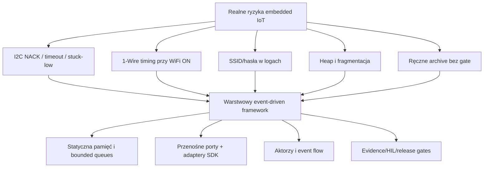
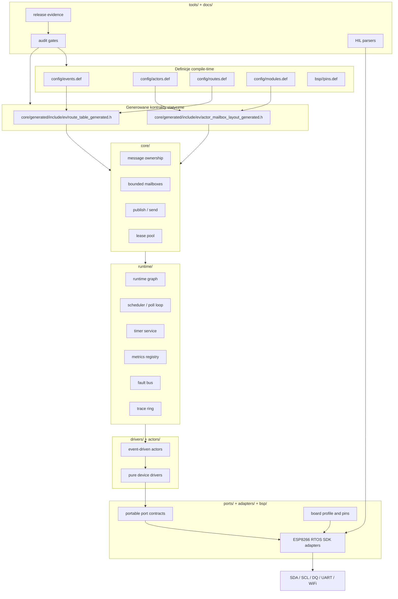
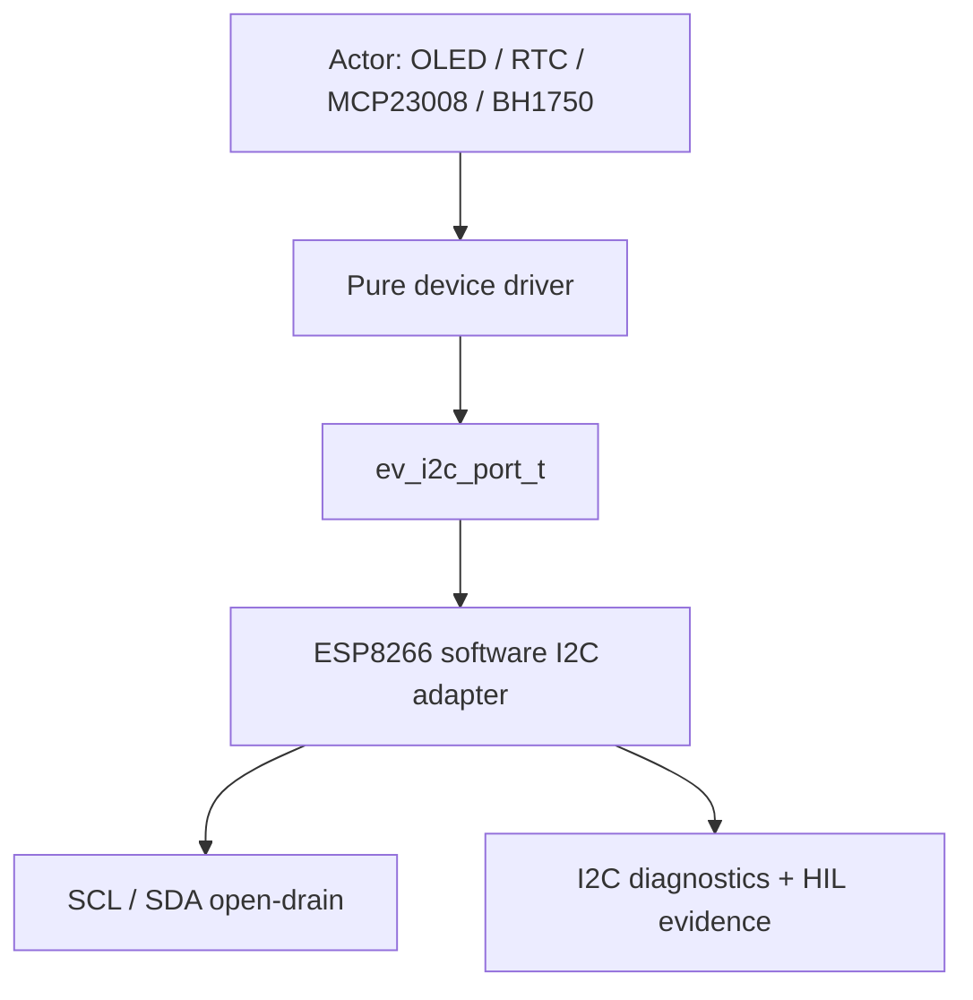
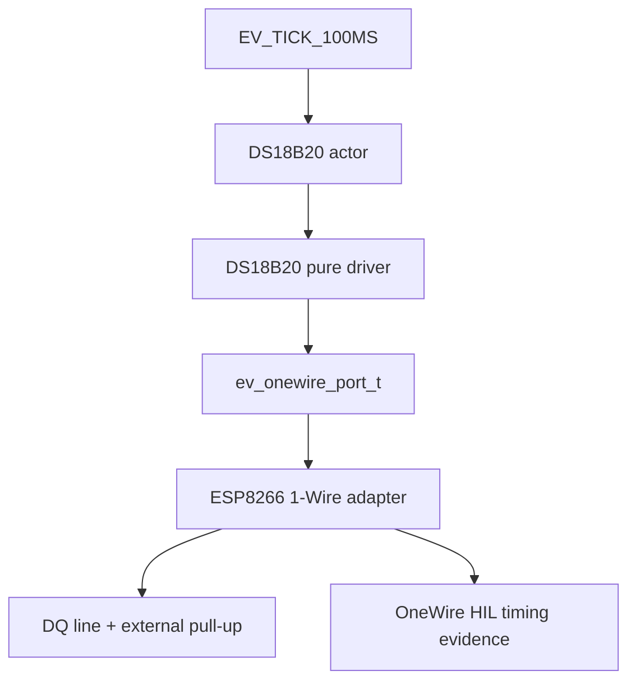

# ESP8266 Event-Driven Framework

`esp8266-event-driven-framework` to statyczno-pamięciowy, evidence-driven, event-driven framework w C dla systemów opartych o ESP8266 RTOS SDK. Projekt został zbudowany z myślą o małych urządzeniach IoT, ale z rygorem typowym dla systemów embedded, w których ważne są: przewidywalność czasu wykonania, brak alokacji w hot-path, czyste granice warstw, testowalność na hoście, HIL oraz kontrolowane release evidence.

To repozytorium **nie jest typowym przykładem Arduino/ESP8266** typu `setup()` / `loop()` ani prostą aplikacją ESP-IDF/ESP8266 z logiką wrzuconą do `main.c`. Jest to framework warstwowy: ma generowane route table, aktorów, bounded mailboxy, statyczne układy pamięci, przenośne porty, adaptery ESP8266, BSP profile, czyste drivery sensorów, host tests, sanitizer gates, HIL parsers, release gates oraz politykę prywatnych sekretów.

Projekt jest prowadzony według pięciu filarów jakości:

| Filar | Znaczenie w tym projekcie |
|---|---|
| **Filar 1: Hot-Path bez alokacji / Pure Core & Zero-Copy** | Krytyczne ścieżki runtime używają statycznej pamięci, bounded mailboxów, jasnego modelu ownership wiadomości oraz nie alokują heap w czasie pracy. |
| **Filar 2: Clean Architecture / izolacja warstw** | `core`, `runtime`, `ports`, `drivers`, `actors`, `bsp`, `adapters`, `apps` i `tools` mają jawne odpowiedzialności i kontrolowane zależności. |
| **Filar 3: Evidence-Based Engineering, tryb łagodzony RE** | Twierdzenia jakościowe muszą mieć dowód: testy hostowe, sanitizer, route/static contracts, SDK logs, HIL parsers, self-clean archive i release evidence. |
| **Filar 4: Zero Undefined Behavior / sanitizer readiness** | Projekt ma strict C17 + `-Werror` oraz deterministyczne shardy ASAN/UBSAN dla kluczowych kontraktów. |
| **Filar 5: Event-Driven / asynchroniczny przepływ zdarzeń** | Aktorzy komunikują się przez generowane trasy i bounded mailboxy. Drivery są czystym protokołem, a aktorzy odpowiadają za scheduling, retry/backoff i publish. |

---

## Spis treści

- [Najkrótsza ścieżka użycia](#najkrótsza-ścieżka-użycia)
- [Dlaczego ten projekt IoT jest zbudowany nietypowo](#dlaczego-ten-projekt-iot-jest-zbudowany-nietypowo)
- [Architektura](#architektura)
- [Przepływ zdarzeń runtime](#przepływ-zdarzeń-runtime)
- [Struktura repozytorium](#struktura-repozytorium)
- [Walidacja hostowa](#walidacja-hostowa)
- [Release archive](#release-archive)
- [Kompilacja SDK dla Wemos ESP-WROOM-02 18650](#kompilacja-sdk-dla-wemos-esp-wroom-02-18650)
- [Flashowanie i monitor szeregowy](#flashowanie-i-monitor-szeregowy)
- [Prywatne sekrety WiFi i redakcja evidence](#prywatne-sekrety-wifi-i-redakcja-evidence)
- [I2C](#i2c)
- [1-Wire / DS18B20](#1-wire--ds18b20)
- [BH1750](#bh1750)
- [HIL i realne dowody sprzętowe](#hil-i-realne-dowody-sprzętowe)
- [Najczęstsze problemy](#najczęstsze-problemy)
- [Aktualna dojrzałość i następne kroki](#aktualna-dojrzałość-i-następne-kroki)

---

## Najkrótsza ścieżka użycia

Codzienna walidacja hostowa:

```bash
git clean -fdx
git status --short

export EV_REPO_MODE=PRIVATE_REPO

make evidence-redaction-check
make private-repo-secrets-policy
make host-test
make property-test
make host-strict-test
make host-sanitize-test
```

Poprawna ścieżka release:

```bash
git clean -fdx
git status --short

export EV_REPO_MODE=PRIVATE_REPO

./tools/fw release-gate
./tools/fw release-archive

ARCHIVE="$(ls -t esp8266-event-driven-framework_*.tar.gz | head -n 1)"
echo "$ARCHIVE"
EV_RELEASE_ARCHIVE_PATH="$ARCHIVE" make release-archive-self-clean-gate
sha256sum "$ARCHIVE" > "$ARCHIVE.sha256"
```

Artefakty release trzymaj poza repozytorium:

```bash
mkdir -p ~/esp8266-release-artifacts
cp "$ARCHIVE" "$ARCHIVE.sha256" ~/esp8266-release-artifacts/
```

Nie używaj ręcznego `git archive` jako normalnego workflow. Poprawna ścieżka to `./tools/fw release-archive`, bo ona uruchamia release gates i sprawdza archive jako self-clean.

---

## Dlaczego ten projekt IoT jest zbudowany nietypowo

Typowy projekt IoT często wygląda tak:

```text
main.c -> init WiFi -> init sensor -> while loop -> read -> publish -> delay
```

To działa dla prostych demonstracji, ale źle skaluje się przy realnych płytkach, wspólnych magistralach, opóźnieniach, błędach I2C, timingach 1-Wire, prywatnych sekretach, release evidence i długotrwałej pracy.

Ten projekt jest bardziej rygorystyczny, ponieważ w praktyce ESP8266 może zawieść w miejscach, które nie są widoczne w prostym demo:

- I2C może pozostać w stanie zablokowanym, jeśli po NACK/timeout nie ma STOP/release.
- 1-Wire DS18B20 jest wrażliwy na jitter, WiFi i preempcję.
- Brak opcjonalnego sensora nie może powodować retry co 100 ms i zaśmiecać magistrali.
- Sekrety WiFi mogą przypadkowo trafić do logów SDK i release evidence.
- Heap w hot-path może powodować fragmentację i skoki latencji.
- Parser HIL self-test nie jest realnym hardware PASS.
- Ręcznie zrobiony archive może ominąć release gates.

Dlatego projekt rozdziela czysty kod domenowy, runtime, adaptery, BSP, porty, aktorów i dowody release.



---

## Architektura



### Reguła zależności

```text
core      -> brak SDK, brak BSP, brak FreeRTOS, brak logiki konkretnego aktora
runtime   -> core + usługi runtime, bez ESP8266 SDK internals
drivers   -> czysty protokół urządzenia, bez runtime i bez actor context
actors    -> state machine, retry/backoff, publish, bez bezpośredniego SDK I2C/1-Wire
ports     -> przenośne kontrakty, bez zależności od ESP8266
adapters  -> ESP8266 RTOS SDK, FreeRTOS, GPIO, UART, WiFi, WDT, BSP wiring
bsp       -> profile boardów, piny, board-local secrets
tools     -> routegen, audit, HIL, release, SDK matrix, serial monitor
```

Publiczne `core/`, `runtime/`, `ports/`, `drivers/` i `actors/` nie mogą zależeć od `esp_err_t`, `TickType_t`, `driver/i2c.h`, SDK I2C command-link API, BSP pin headers ani adapter internals.

---

## Przepływ zdarzeń runtime

```mermaid
sequenceDiagram
    participant Source as Timer / ingress / adapter
    participant Routes as Generated route table
    participant Mailbox as Actor mailbox
    participant Actor as Actor handler
    participant Driver as Pure driver
    participant Port as Portable port
    participant Adapter as ESP8266 adapter
    participant Evidence as Metrics / trace / evidence

    Source->>Routes: publish event
    Routes->>Mailbox: bounded enqueue
    Mailbox->>Actor: dispatch message
    Actor->>Driver: protocol request
    Driver->>Port: read/write through contract
    Port->>Adapter: hardware-specific operation
    Adapter-->>Port: bounded status
    Port-->>Driver: data/status
    Driver-->>Actor: decoded result
    Actor->>Evidence: metrics / fault / publish
```

Aktor nie powinien znać szczegółów ESP8266 SDK. Adapter nie powinien znać logiki domenowej sensora. Driver nie powinien publikować eventów. Każda warstwa ma jedno zadanie.

---

## Struktura repozytorium

```text
core/       Prymitywy frameworka: wiadomości, ownership, mailboxes, route table,
            lease pool, publish/send, actor runtime primitives.

runtime/    Runtime graph, scheduler, actor instances, timers, ingress, delivery,
            quiescence, metrics, fault bus, trace ring, command security,
            network outbox.

ports/      Przenośne kontrakty: I2C, 1-Wire, clock, log, network, WDT.
            Nagłówki portów muszą być neutralne względem ESP8266 SDK.

drivers/    Czyste protokoły urządzeń, np. DS18B20 i BH1750. Bez runtime,
            bez actor context, bez typów SDK.

actors/     Event-driven state machines: boot, tick, retry, backoff, publish,
            fault reporting i obsługa urządzeń opcjonalnych.

adapters/   ESP8266 RTOS SDK integration: GPIO, software I2C, 1-Wire, WiFi,
            UART, WDT, runtime app i targety SDK/HIL.

bsp/        Profile boardów, piny, wiring truth i private board-local secrets.

apps/       Composition roots i demo application wiring.

config/     Deklaratywne katalogi: events, actors, routes, modules, pins,
            capabilities, memory budgets i evidence definitions.

tools/      Routegen, audit gates, release tools, SDK matrix, HIL parsers,
            serial monitor i WiFi secret helpers.

docs/       Architektura, HIL contracts, release evidence, specs, reports.

tests/      Host tests, property tests i fakes.
```

---

## Walidacja hostowa

Podstawowa walidacja:

```bash
make clean
make routegen-check
make static-contracts
make host-test
make property-test
```

Strict build:

```bash
make host-strict-test
```

`host-strict-test` używa C17 i `-Werror`.

Sanitizery:

```bash
make clean
export ASAN_OPTIONS="abort_on_error=1:halt_on_error=1:detect_leaks=0:symbolize=1"
export UBSAN_OPTIONS="halt_on_error=1"
make -j1 host-sanitize-test
unset ASAN_OPTIONS
unset UBSAN_OPTIONS
```

Oczekiwany wynik:

```text
host-sanitize-test passed (deterministic ASAN/UBSAN shards)
```

### Uwaga dla Linux + ASAN

Jeżeli pojawia się wielokrotne:

```text
AddressSanitizer:DEADLYSIGNAL
```

sprawdź:

```bash
sudo cat /proc/sys/vm/mmap_rnd_bits
```

Jeżeli wynik to `32`, ustaw dla maszyny developerskiej:

```bash
sudo sysctl -w vm.mmap_rnd_bits=28
```

Na stałe:

```bash
echo 'vm.mmap_rnd_bits=28' | sudo tee /etc/sysctl.d/99-asan-mmap-rnd.conf
sudo sysctl --system
sudo cat /proc/sys/vm/mmap_rnd_bits
```

---

## Release archive

Release archive twórz na czystym repo i **przed SDK buildem**.

```bash
git clean -fdx
git status --short

export EV_REPO_MODE=PRIVATE_REPO

./tools/fw release-gate
./tools/fw release-archive
```

Weryfikacja archive:

```bash
ARCHIVE="$(ls -t esp8266-event-driven-framework_*.tar.gz | head -n 1)"
echo "$ARCHIVE"
EV_RELEASE_ARCHIVE_PATH="$ARCHIVE" make release-archive-self-clean-gate
sha256sum "$ARCHIVE" > "$ARCHIVE.sha256"
```

Oczekiwany wynik:

```text
EV_RELEASE_ARCHIVE_SELF_CLEAN PASS archive=<archive>.tar.gz mode=PRIVATE_REPO
```

Przenieś artefakty poza repo:

```bash
mkdir -p ~/esp8266-release-artifacts
cp "$ARCHIVE" "$ARCHIVE.sha256" ~/esp8266-release-artifacts/
```

Nie commituj:

```text
*.tar.gz
*.sha256
build/
sdkconfig
__pycache__/
adapters/esp8266_rtos_sdk/targets/*/build/
```

---

## Kompilacja SDK dla Wemos ESP-WROOM-02 18650

SDK build wykonuj dopiero po release/archive albo po `git clean -fdx`.

Ustaw jawny target:

```bash
mkdir -p build

export WEMOS_PROJECT=adapters/esp8266_rtos_sdk/targets/wemos_esp_wroom_02_18650
export FW_SDK_PROJECT_DIR="$WEMOS_PROJECT"
export EV_WEMOS_FLASH_VARIANT=4mb
export FW_MONITOR_BAUD=115200

echo "$FW_SDK_PROJECT_DIR"
```

Sprawdź sekrety i wyczyść SDK target:

```bash
./tools/fw wifi-secrets-status
./tools/fw sdk-distclean
```

Buduj markerowaną ścieżką:

```bash
./tools/fw sdk-build-one wemos_esp_wroom_02_18650 2>&1 | tee build/sdk-current.log
```

Sprawdź markery:

```bash
grep -E 'EV_SDK_BUILD_(BEGIN|TARGET|STATUS|END)' build/sdk-current.log
grep 'EV_SDK_BUILD_TARGET=wemos_esp_wroom_02_18650' build/sdk-current.log
```

Oczekiwany wzór:

```text
EV_SDK_BUILD_TARGET=wemos_esp_wroom_02_18650
EV_SDK_BUILD_BEGIN
EV_SDK_BUILD_STATUS=PASS
EV_SDK_BUILD_END
EV_SDK_BUILD_TARGET=wemos_esp_wroom_02_18650
```

Warning policy:

```bash
python3 tools/audit/sdk_warning_policy.py \
  --project-only \
  --latest-build-session \
  --session-kind build \
  --strict-build-session \
  --target wemos_esp_wroom_02_18650 \
  build/sdk-current.log
```

Oczekiwany wynik:

```text
sdk-project-warning-policy passed warnings=0 build_status=PASS session_mode=EV_SDK_BUILD_BLOCK target=wemos_esp_wroom_02_18650
```

Nie używaj plain `./tools/fw sdk-build` jako głównej walidacji release/evidence. `sdk-build-one` daje jawny blok `EV_SDK_BUILD_BEGIN/END` i target.

---

## Flashowanie i monitor szeregowy

Przed każdym flashowaniem ustaw Wemos target w tej samej sesji terminala:

```bash
export FW_SDK_PROJECT_DIR=adapters/esp8266_rtos_sdk/targets/wemos_esp_wroom_02_18650
export FW_ESPPORT=/dev/ttyUSB0
export FW_MONITOR_BAUD=115200

echo "$FW_SDK_PROJECT_DIR"
```

Flash:

```bash
./tools/fw sdk-flash
```

Poprawny log musi pokazywać:

```text
make: Entering directory '/work/adapters/esp8266_rtos_sdk/targets/wemos_esp_wroom_02_18650'
App "ev_wroom_02" version: <commit>
Hash of data verified.
```

Jeżeli log pokazuje:

```text
targets/esp8266_generic_dev
App "ev_esp8266_generic_dev"
```

flashujesz zły target. Przerwij, ustaw ponownie `FW_SDK_PROJECT_DIR` i powtórz build/flash.

Monitor:

```bash
./tools/fw sdk-simple-monitor
```

Dla Wemos typowy baud:

```text
115200
```

Zakończenie monitora przez `Ctrl+C` jest normalne i nie oznacza crasha firmware.

---

## Prywatne sekrety WiFi i redakcja evidence

Projekt wspiera świadomy tryb private-lab.

Dozwolone w prywatnym repo:

```text
bsp/<board>/board_secrets.local.h
PRIVATE_LAB_SECRET_SOURCE
PRIVATE_LAB_RAW_EVIDENCE
```

Zabronione zawsze:

```text
literalne sekrety w redacted logs
literalne sekrety w normalized logs
literalne sekrety w raportach markdown
literalne sekrety w manifestach / JSON / summaries
literalne sekrety w patchach / ZIP-ach / CI diff output
literalne sekrety w public artifacts
```

Ustaw tryb:

```bash
export EV_REPO_MODE=PRIVATE_REPO
```

Sprawdź redakcję i policy:

```bash
make evidence-redaction-check
make private-repo-secrets-policy
```

Oczekiwany wynik:

```text
EV_EXISTING_EVIDENCE_REDACTION DRY_RUN files_changed=0 hash_repairs=0
private repo secrets policy passed mode=PRIVATE_REPO
```

Jeżeli istniejące evidence wymaga redakcji:

```bash
make repair-evidence-redaction
make evidence-redaction-check
make private-repo-secrets-policy
```

Potem sprawdzaj tylko nazwy plików:

```bash
git status --short
git diff --name-only
```

Nie używaj plain `git diff` na historycznych evidence logs, jeśli mogły zawierać sekret w usuwanych liniach.

---

## I2C

Projekt celowo nie opiera runtime I2C na SDK command-link API. Zamiast tego używa bounded software I2C master w adapterze ESP8266 i czystego `ev_i2c_port_t`.



Reguły:

- publiczne adresy I2C są 7-bitowe,
- operacje są bounded,
- hot-path nie alokuje heap,
- `read_stream` obsługuje surowe odczyty, np. BH1750,
- STOP/release jest wymagany po NACK/timeout/fault, gdy elektrycznie możliwe,
- recovery jest dla stuck-low, timeout, failed STOP/release lub wymaganych device failures,
- normalny scan-NACK nie powinien wywoływać recovery,
- domyślnie używaj 100 kHz,
- 400 kHz wymaga logic-analyzer evidence.

---

## 1-Wire / DS18B20

DS18B20 jest rozdzielony na driver, actor i adapter:

```text
drivers/src/ev_ds18b20_driver.c      CRC, scratchpad decode, pure protocol
actors/device/ev_ds18b20_actor.c     scheduling, conversion deadline, publish
adapters/.../ev_onewire_adapter.c    ESP8266 timing/open-drain implementation
```



Reguły:

- scratchpad CRC jest obowiązkowe,
- actor nie publikuje nowej temperatury przy CRC failure,
- konwersja jest deadline-based,
- `EV_TICK_100MS` jest kanonicznym źródłem czasu konwersji,
- realny PASS timingowy wymaga HIL z WiFi ON.

---

## BH1750

BH1750 jest wzorcowym małym sensorem po wprowadzeniu `read_stream`.

```text
drivers/src/ev_bh1750_driver.c       pure driver, lux conversion
actors/device/ev_bh1750_actor.c      boot, tick, optional-device retry/backoff, publish
ports/include/ev/port_i2c.h          read_stream contract
```

Brak BH1750 na magistrali jest obsługiwany jako optional-device condition. Actor nie powinien retry'ować I2C co 100 ms po NACK; używa bounded backoff.

---

## HIL i realne dowody sprzętowe

Repo zawiera parsery i kontrakty dla:

- ATNEL I2C HIL,
- ATNEL OneWire/DS18B20 HIL,
- Wemos smoke evidence,
- runtime eventflow metrics,
- SDK build evidence,
- release archive evidence,
- logic-analyzer readiness.

Najważniejsza zasada:

```text
PARSER_SELF_TEST_PASS != REAL_HIL_PASS
```

Brak fizycznego boardu, serial logu, logic-analyzer capture, runtime soak transcriptu albo SDK memory/stack artefaktu to:

```text
ENVIRONMENT_BLOCKED
```

a nie PASS.

Następne realne dowody jakości powinny obejmować:

```text
I2C:
  START, ACK, NACK + STOP, final NACK, STOP release,
  bus idle after fault, SDA stuck-low recovery, SCL timeout.

OneWire:
  WiFi ON, reset/presence timing, read/write slots,
  scratchpad CRC, DQ release.

Runtime:
  30+ minut soak, dropped_events=0, backpressure_events=0,
  timer_deadline_misses=0, WDT reset=0.

SDK:
  memory/stack regression per target.
```

---

## Najczęstsze problemy

### `patch-hygiene-gate` zgłasza SDK generated files

Przyczyna: release-prearchive został uruchomiony po SDK buildzie.

Naprawa:

```bash
git clean -fdx
make -j1 release-prearchive-gate
```

### `AddressSanitizer:DEADLYSIGNAL`

Sprawdź:

```bash
sudo cat /proc/sys/vm/mmap_rnd_bits
```

Jeżeli wynik to `32`:

```bash
sudo sysctl -w vm.mmap_rnd_bits=28
make clean
make -j1 host-sanitize-test
```

### Flashuje `esp8266_generic_dev`

Przyczyna: nie ustawiono `FW_SDK_PROJECT_DIR` w aktualnym terminalu.

Naprawa:

```bash
export FW_SDK_PROJECT_DIR=adapters/esp8266_rtos_sdk/targets/wemos_esp_wroom_02_18650
export FW_ESPPORT=/dev/ttyUSB0
./tools/fw sdk-flash
```

### `EV_RELEASE_ARCHIVE_SELF_CLEAN FAIL`

Nie publikuj archive. Uruchom:

```bash
make evidence-redaction-check
make private-repo-secrets-policy
make -j1 release-prearchive-gate
./tools/fw release-archive
```

### SDK warning policy nie widzi markerów

Użyj `sdk-build-one`:

```bash
./tools/fw sdk-build-one wemos_esp_wroom_02_18650 2>&1 | tee build/sdk-current.log
```

---

## Aktualna dojrzałość i następne kroki

Fundament software jest dojrzały: istnieją host tests, strict tests, deterministic sanitizer shards, self-clean release archive, SDK warning policy, I2C `read_stream`, DS18B20 pure driver oraz BH1750 pure driver/actor.

Następny wzrost jakości powinien pochodzić z realnych artefaktów sprzętowych, nie z kolejnych dużych funkcji:

1. realny I2C logic-analyzer HIL,
2. realny OneWire WiFi-ON HIL,
3. 30+ minut Wemos runtime soak,
4. SDK memory/stack regression z realnych artefaktów,
5. dopiero potem BME280.

Nie dodawaj BME280, dopóki HIL/soak/release evidence nie są stabilne.

---

## Komendy referencyjne

```bash
# Clean
rm -f esp8266-event-driven-framework_*.tar.gz esp8266-event-driven-framework_*.tar.gz.sha256
git clean -fdx

# Host validation
make host-test
make property-test
make host-strict-test
make host-sanitize-test

# Release
./tools/fw release-gate
./tools/fw release-archive

# Verify archive
ARCHIVE="$(ls -t esp8266-event-driven-framework_*.tar.gz | head -n 1)"
EV_RELEASE_ARCHIVE_PATH="$ARCHIVE" make release-archive-self-clean-gate
sha256sum "$ARCHIVE" > "$ARCHIVE.sha256"

# Wemos SDK build
export FW_SDK_PROJECT_DIR=adapters/esp8266_rtos_sdk/targets/wemos_esp_wroom_02_18650
export EV_WEMOS_FLASH_VARIANT=4mb
export FW_MONITOR_BAUD=115200
./tools/fw sdk-build-one wemos_esp_wroom_02_18650 2>&1 | tee build/sdk-current.log

# Wemos warning policy
python3 tools/audit/sdk_warning_policy.py \
  --project-only \
  --latest-build-session \
  --session-kind build \
  --strict-build-session \
  --target wemos_esp_wroom_02_18650 \
  build/sdk-current.log

# Flash + monitor
export FW_ESPPORT=/dev/ttyUSB0
./tools/fw sdk-flash
./tools/fw sdk-simple-monitor
```
